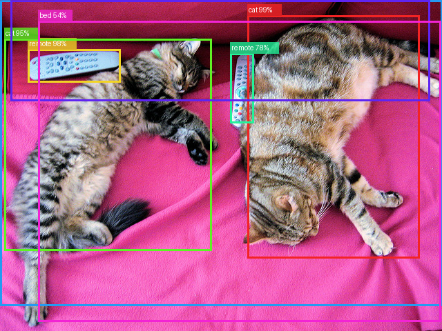

# Object Detection — Faster R-CNN

Detect and localise multiple objects in an image in a single pass. The model draws a bounding box around each detected object and labels it with the class name and confidence score.

## The model

**Faster R-CNN** with a ResNet-50 FPN backbone, pretrained on the MS-COCO dataset (91 classes — people, vehicles, animals, household items and more). No training required; the pretrained weights are downloaded automatically on first run and cached by PyTorch.

The model works in two stages: a Region Proposal Network (RPN) first scans the image to suggest candidate regions, then a classifier scores each region and refines the bounding boxes.

## How to run

```bash
python object_detection.py
```

On first run the script downloads three sample images from the COCO validation set to `data/sample_images/` and runs detection on them. Annotated images are saved to `plots/`.

You can also point it at your own images:

```bash
python object_detection.py --images-dir /path/to/my/images
```

Optional flags:

```bash
python object_detection.py --threshold 0.7   # raise confidence threshold (fewer, more certain detections)
```

## Expected results

On the three default COCO samples you should see:
- **sample_cats.jpg** — 2 cats detected on a sofa
- **sample_kitchen.jpg** — dining table, chairs, bottles, cups
- **sample_sports.jpg** — person, sports ball, and other objects

Typical mAP@0.5 for this model on the full COCO val set is around **37%**, which is solid for a general-purpose two-stage detector.

## Code structure

```
ObjectDetector
├── load_model()              → loads Faster R-CNN with COCO pretrained weights, eval mode
├── predict(image)            → returns boxes, labels and scores above threshold
├── annotate(image, preds)    → draws colored bounding boxes and label text on a copy of the image
└── run(images_dir)           → iterates a directory, annotates each image, saves to plots/
```

## Sample output


