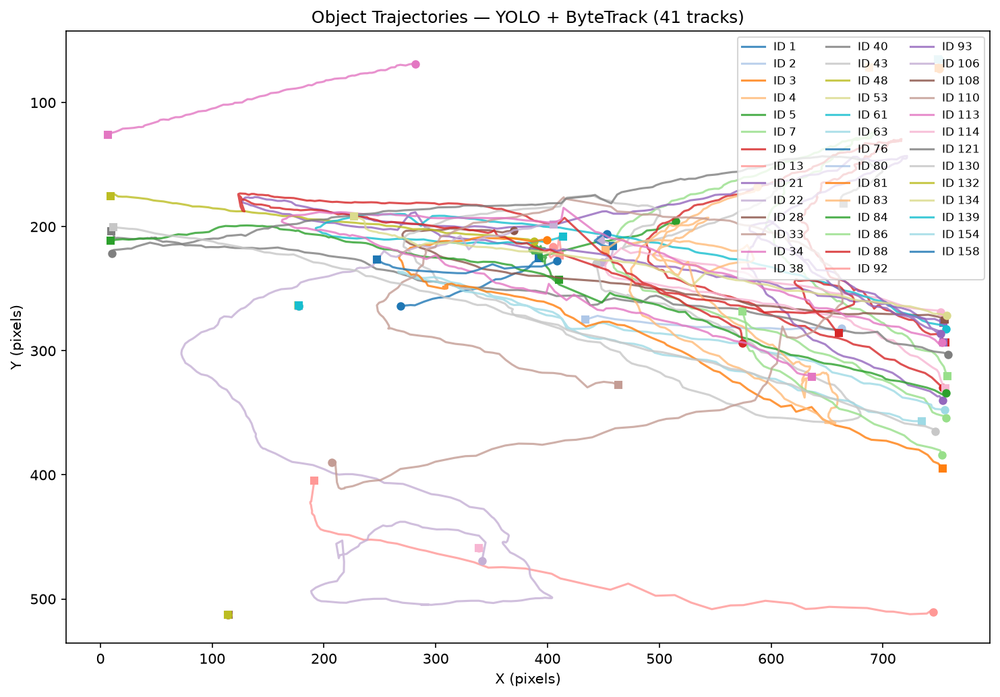

# Object Tracking — YOLO11 + ByteTrack

Track every moving object across all frames of a video, with a persistent ID that stays consistent from the first frame to the last. Each object gets its own colour and label so you can follow multiple people or vehicles at once.

## The approach

**YOLO11** re-detects all objects on every single frame. **ByteTrack** then links those detections across frames using IoU matching, assigning each unique object a stable integer ID for the duration of the video.

This is fundamentally more reliable than a correlation filter like CSRT because there is no drift — the detector starts fresh each frame rather than chasing a stale template. Multiple objects are tracked simultaneously, and IDs survive short occlusions thanks to ByteTrack's second-pass low-confidence matching.

## The video

The default video is **vtest.avi**, a classic OpenCV sample showing people walking through a corridor. It is downloaded automatically from the OpenCV GitHub repository (~2.6 MB) to `data/vtest.avi` on first run. The YOLO11 nano weights (~2.6 MB) are also downloaded automatically to `~/.cache/ultralytics/` on first run.

## How to run

```bash
python object_tracking.py
```

The script downloads what it needs, tracks all objects frame by frame, saves an annotated video to `plots/tracked_output.mp4`, and saves a multi-trajectory plot to `plots/trajectory.png`.

You can also provide your own video:

```bash
python object_tracking.py --video-path /path/to/my_video.mp4
python object_tracking.py --conf 0.4          # raise confidence threshold
python object_tracking.py --model yolo11s.pt  # use a larger, more accurate model
python object_tracking.py --no-plot           # skip trajectory PNG
```

## Expected results

On `vtest.avi` you should see 5–10 unique pedestrian IDs tracked across the scene. The trajectory plot shows each person's path through the frame as a coloured line, with a circle for their start point and a square for their end point.

## Code structure

```
ObjectTracker
├── load_model()               → loads YOLO11n (downloads weights on first run)
├── _download_video()          → downloads vtest.avi if not already present
├── track(video_path, output)  → per-frame YOLO detection + ByteTrack linking, writes annotated video
├── save_trajectory_plot(dir)  → multi-object trajectory plot saved as PNG
└── run(...)                   → orchestrates download → track → plot
```

## Sample output


