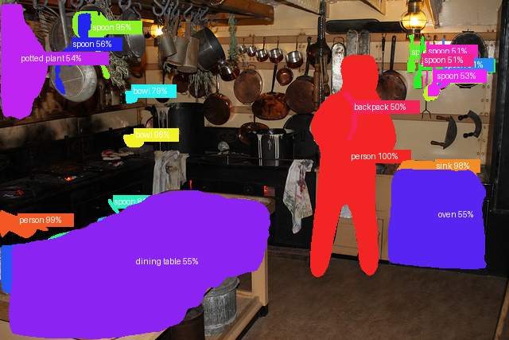

# Image Segmentation — Mask R-CNN

Go beyond bounding boxes — this project detects every object instance in an image and paints an individual coloured mask over each one. You can tell exactly which pixels belong to which object.

## The model

**Mask R-CNN** with a ResNet-50 FPN backbone, pretrained on MS-COCO. It extends Faster R-CNN by adding a small mask-prediction head that runs in parallel with the bounding-box head. For each detected instance it outputs a binary mask at the same resolution as the image.

The model handles **instance segmentation** — each individual object gets its own mask even when multiple objects of the same class overlap. That is different from semantic segmentation, which only distinguishes class regions (no per-object separation).

## How to run

```bash
python image_segmentation.py
```

On first run the script downloads the same three COCO sample images used by the detection project to `data/sample_images/` and segments them. Annotated images are saved to `plots/`.

Point it at your own images:

```bash
python image_segmentation.py --images-dir /path/to/my/images
```

Optional flags:

```bash
python image_segmentation.py --threshold 0.7     # fewer, more confident instances
python image_segmentation.py --alpha 0.4         # make mask overlays more transparent
```

## Expected results

On the three default samples you should see each detected object (people, cats, chairs, bottles…) covered by a distinct coloured mask with a label at its centroid. Multiple objects of the same class get different colours so they are visually separated.

The quality is noticeably better than a bounding box — you can see the exact outline of a person or a cat rather than a rectangle that includes background.

## Code structure

```
ImageSegmenter
├── load_model()               → loads Mask R-CNN with COCO pretrained weights, eval mode
├── predict(image)             → returns per-instance masks, labels and scores above threshold
├── overlay_masks(image, preds)→ blends coloured transparent masks onto the image, adds labels
└── run(images_dir)            → iterates a directory, segments each image, saves to plots/
```

## Sample output


