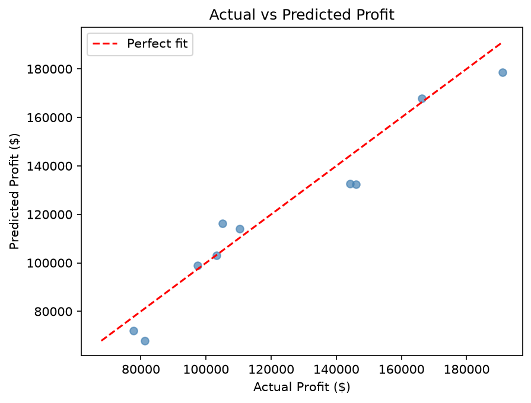

# Startup Profit Prediction — Multiple Linear Regression

Predicts the profit of a startup based on its R&D spend, administration costs, marketing spend, and the state it operates in. The state column is categorical so there's a one-hot encoding step before fitting.

## The dataset

`50_Startups.csv` has 50 rows and five columns: R&D Spend, Administration, Marketing Spend, State, and Profit. Three US states appear in the data (New York, California, Florida).

## Results

Multiple linear regression gets an R² around **0.93** on this dataset. R&D spend is by far the most influential feature — you can roughly predict profit from that column alone. Administration and marketing have much weaker relationships.

## How to run

```bash
python multiple_linear_regression.py
```

Saves one plot to `plots/actual_vs_predicted.png` — a scatter of actual profit vs predicted profit with a perfect-fit diagonal for reference.

## Code structure

```
StartupProfitPredictor
├── load_data()       → reads CSV, separates features from target
├── preprocess()      → one-hot encodes the State column, stores the ColumnTransformer
├── train()           → fits LinearRegression on the processed training set
├── evaluate()        → returns R² and RMSE
└── save_plots()      → actual vs predicted scatter plot
```

The `ColumnTransformer` is stored on the instance (`self._ct`) so it can be reused at prediction time without refitting.

## Notes

The model includes all features including the encoded state dummies. Sklearn's `LinearRegression` handles the dummy variable trap internally (no need to drop one category manually). If you want to try feature selection, R&D Spend alone gives you R² ≈ 0.90, which shows how dominant that single feature is.

## Sample output


