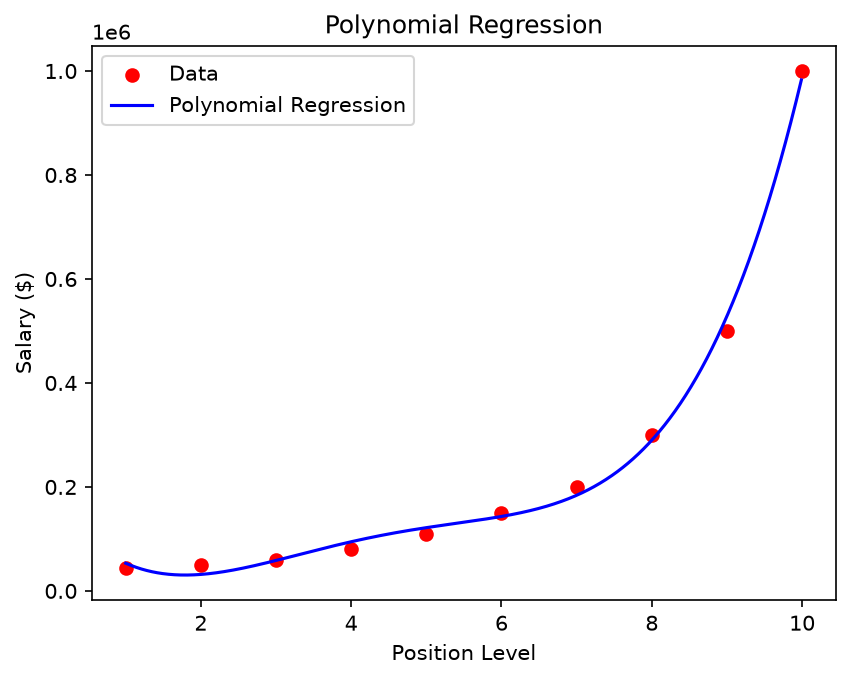
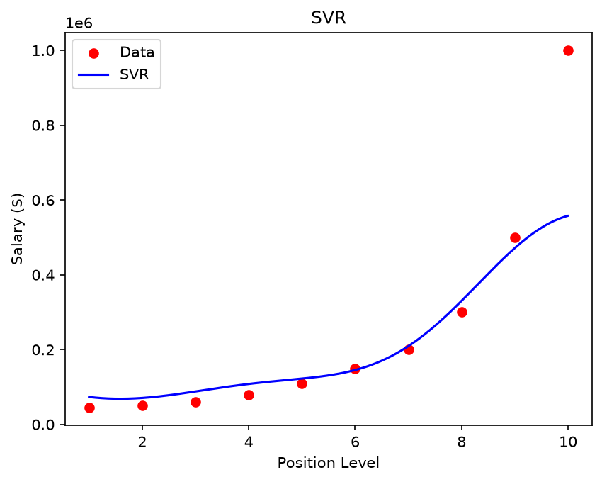
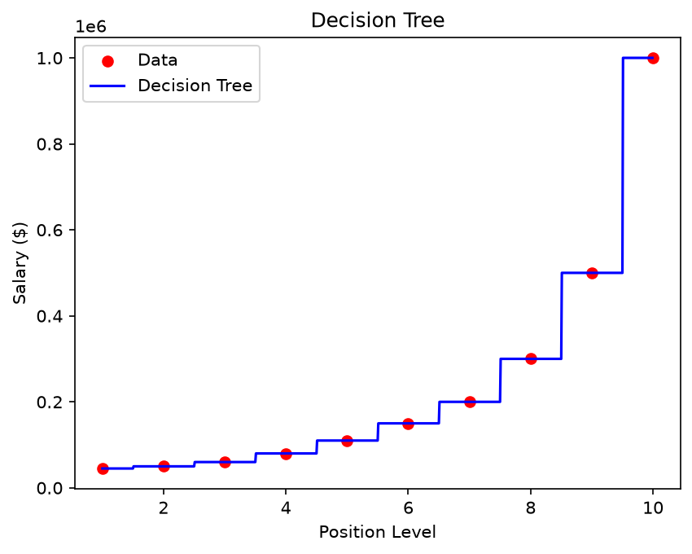
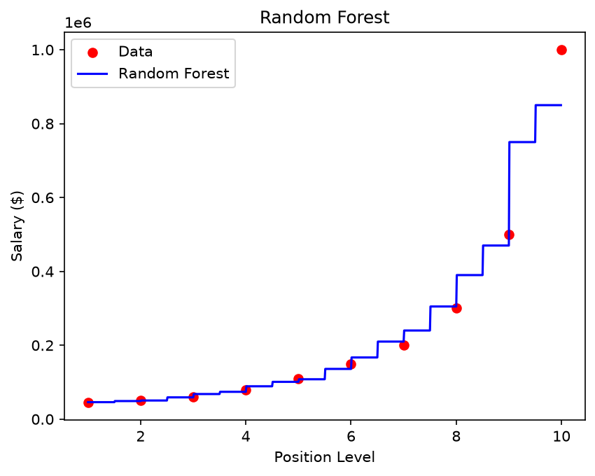

# Position-to-Salary Regression Benchmark

This project fits four different regression models on the same dataset and compares their predictions. The dataset is deliberately tiny (10 rows) and non-linear, which is why simple linear regression isn't included — the interesting comparison is between methods that can handle curves.

## The dataset

`Position_Salaries.csv` maps job levels (1–10) to salaries. The relationship isn't linear — it grows exponentially, which is what makes it a good testbed for non-linear regressors.

## Models compared

| Model | Approach |
|---|---|
| Polynomial Regression | Degree-4 polynomial features + linear model |
| SVR | RBF kernel, both X and y are scaled before fitting |
| Decision Tree | Fits a step function to the data |
| Random Forest | 10 trees, averages their step functions |

All four models train on the **full dataset** (no train/test split) because with only 10 rows a split would be pointless. The goal is to predict the salary for a position level of **6.5** (between Senior and Manager).

## Expected output

```
Predicted salary for position level 6.5:
  Polynomial Regression    : $158,862.45
  SVR                      : $170,370.02
  Decision Tree            : $150,000.00
  Random Forest            : $167,000.00
```

Exact numbers vary slightly. SVR and polynomial regression tend to agree most closely on this dataset.

## How to run

```bash
python main.py
```

Saves four plots to `plots/` — one curve per model — showing how each one fits the training data.

## Code structure

```
RegressionBenchmark
├── load_data()               → reads CSV into self.X and self.y
├── fit_all()                 → trains all 4 models, stores them as callables in self._predictors
├── compare_predictions()     → queries all models at QUERY_LEVEL (default 6.5)
└── save_plots()              → one plot per model, scatter + fitted curve
```

The models are stored as lambdas in a dict so `save_plots()` and `compare_predictions()` both just iterate over the same dict — no code duplication, models fit only once.

## Notes

SVR needs scaling on both X and y, which is why it has its own `StandardScaler` instances. The lambda captures those scalers by reference so the inverse transform is applied automatically when you call `predict()`. The other three models don't need scaling for this dataset.

## Sample output





