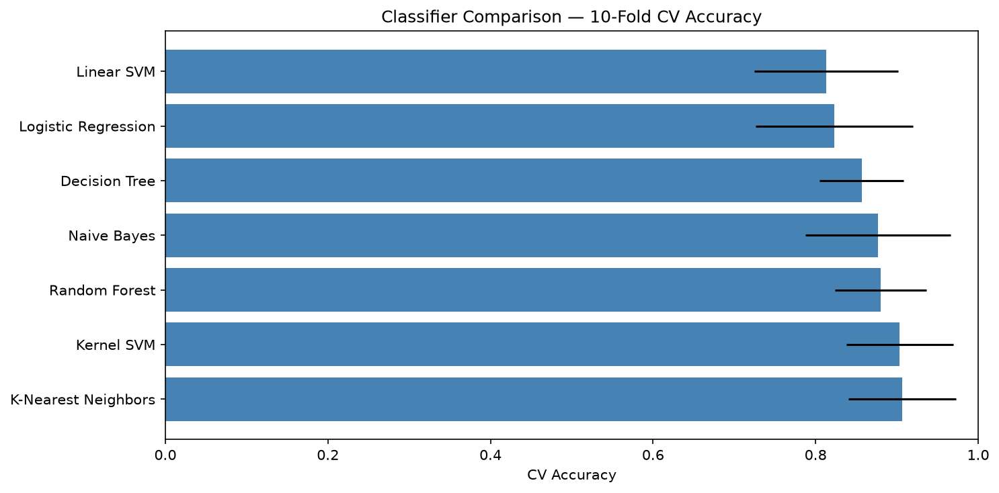
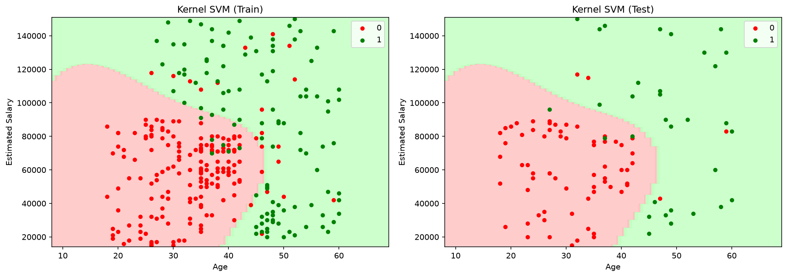
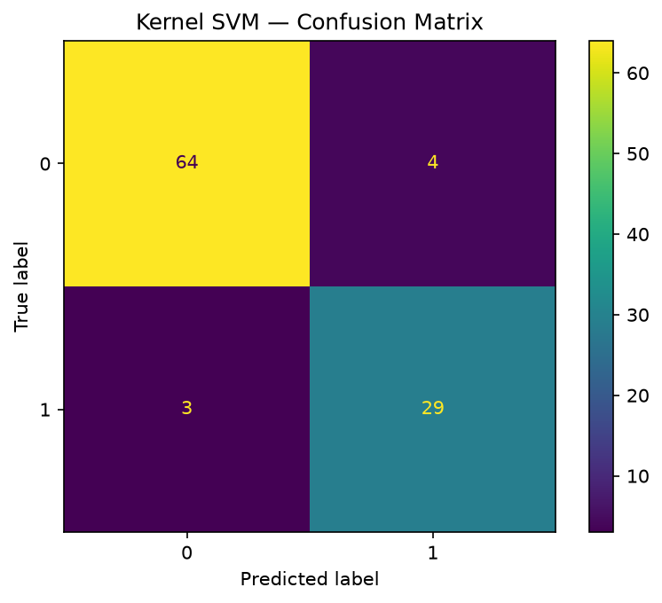

# Ad Purchase Prediction — Classification Benchmark

Predicts whether a social network user will click "buy" on an ad, based on their age and estimated salary. This project runs seven classifiers on the same data, compares them with 10-fold cross-validation, and then runs a grid search to fine-tune the best-performing one (SVM with RBF kernel).

## The dataset

`Social_Network_Ads.csv` has 400 rows, two features (Age, EstimatedSalary), and a binary target (0 = didn't buy, 1 = bought). The decision boundary between the two classes isn't linear — younger low-earners and older high-earners tend to buy, which creates an interesting curved boundary.

## Models compared

| Model | Notes |
|---|---|
| Logistic Regression | Good baseline, straight decision boundary |
| K-Nearest Neighbors | k=5, Minkowski distance |
| Linear SVM | Another linear boundary, usually similar to LR |
| Kernel SVM | RBF kernel — handles the curved boundary well |
| Naive Bayes | Fast, surprisingly decent here |
| Decision Tree | Gini criterion, tends to overfit |
| Random Forest | 10 trees, gini — more stable than a single tree |

## Expected results

Kernel SVM and Random Forest typically come out on top with CV accuracy around **0.90–0.93**. Logistic Regression and Linear SVM land around **0.84** since the boundary isn't linear. The grid search on SVM usually confirms `kernel=rbf` with `C=1` or `C=0.75`.

## How to run

```bash
python main.py
```

Takes a few minutes because of the cross-validation loops and grid search. Output goes to `plots/`:
- `model_comparison.png` — horizontal bar chart of CV accuracy per model
- `boundary_<model>.png` — decision boundary plots for train and test sets (one file per model)
- `cm_<model>.png` — confusion matrix per model

## Code structure

```
ClassificationBenchmark
├── load_data()          → reads CSV, splits 75/25, fits and applies StandardScaler
├── run_all()            → trains all 7 models, records test accuracy + 10-fold CV scores
├── tune_best_model()    → GridSearchCV on SVC with linear and RBF kernels
├── _plot_decision_boundary()  → helper used by save_results()
└── save_results()       → saves comparison chart, decision boundaries, confusion matrices
```

`MODELS` is a class-level dict so adding or swapping a classifier is a one-line change.

## Notes

The decision boundary plots use a step size of 1.0 (age) and 1.0 (salary) for the meshgrid rather than 0.25 — it's faster and visually identical at normal plot resolution. Each model is re-fitted inside `save_results()` to generate the boundary plots; this is by design so `run_all()` stays stateless and the results dict stays clean.

## Sample output




