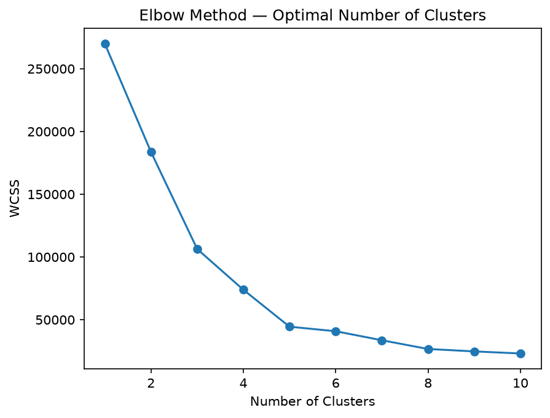
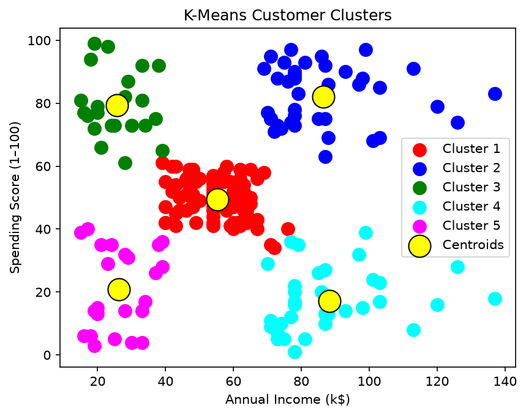
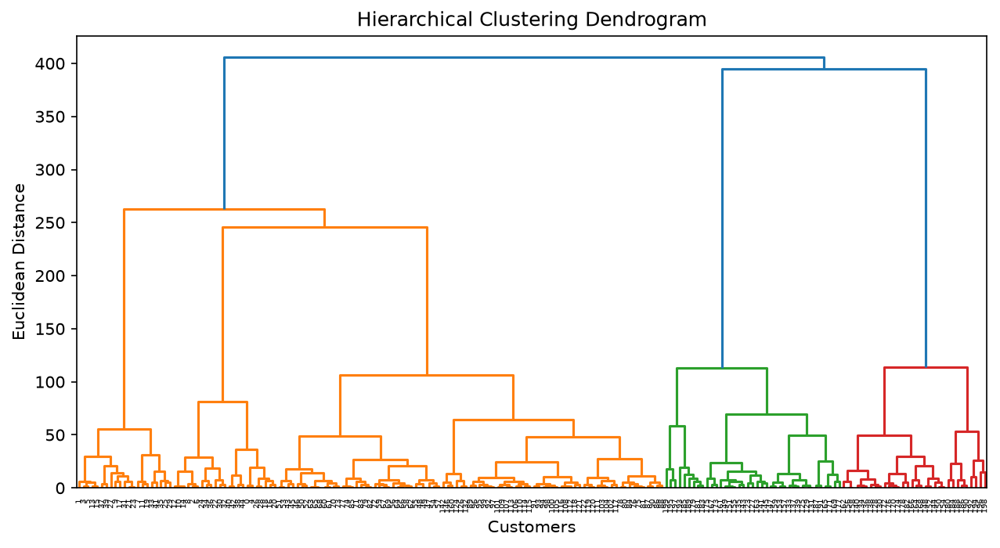
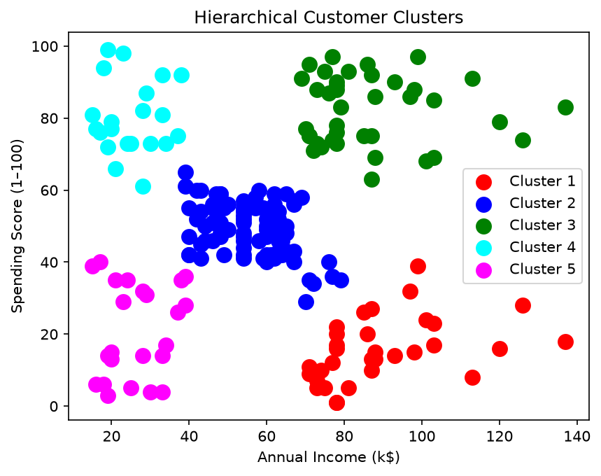

# Mall Customer Segmentation — Clustering

Groups mall customers into segments based on their annual income and spending score. Useful for targeting marketing campaigns — you want to know who your high-income/high-spend customers are versus people who earn a lot but barely spend.

## The dataset

`Mall_Customers.csv` has 200 customers with five columns. This project uses only two: Annual Income (k$) and Spending Score (1–100). Using just two features keeps the clusters easy to visualise on a 2D scatter plot.

## Results

Both K-Means and Hierarchical Clustering find **5 natural clusters** in this data. The elbow method makes this obvious — WCSS drops steeply from 1 to 5 clusters then flattens out. The five segments roughly correspond to:

- Low income, low spending
- Low income, high spending
- Medium income, medium spending
- High income, low spending
- High income, high spending

Both algorithms agree on the segmentation almost perfectly.

## How to run

```bash
python main.py
```

Prints the cluster size distribution for both methods. Saves four plots to `plots/`:
- `elbow_method.png` — WCSS curve to justify 5 clusters
- `dendrogram.png` — hierarchical tree (the cut at 5 is visually obvious)
- `kmeans_clusters.png` — scatter with centroids
- `hierarchical_clusters.png` — same scatter with hierarchical labels

## Code structure

```
CustomerSegmentation
├── load_data()          → reads CSV, keeps only the income and spending columns
├── run_kmeans()         → K-Means with k-means++ init, returns labels + fitted model
├── run_hierarchical()   → Agglomerative clustering with Ward linkage
└── save_plots()         → elbow curve, dendrogram, and both cluster scatter plots
```

## Notes

K-Means++ initialisation (`init='k-means++'`) is used instead of random — it gives more consistent results across runs. Ward linkage in the hierarchical version minimises within-cluster variance, which tends to produce similarly-sized clusters and matches the K-Means result well on this dataset.

## Sample output





