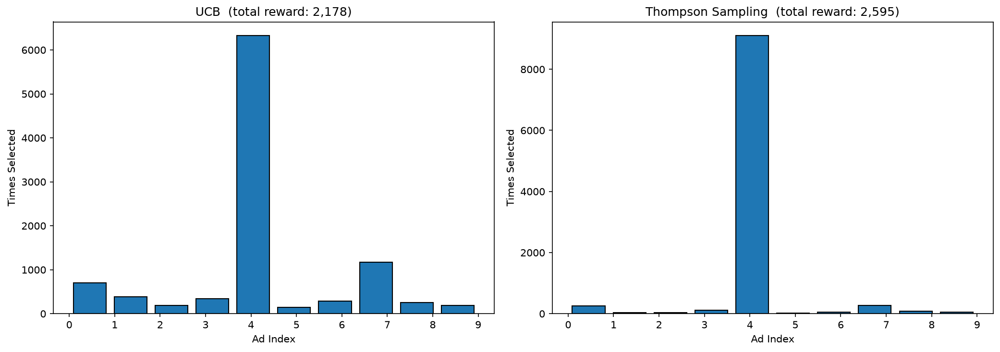

# Ad CTR Optimization — Multi-Armed Bandit

Solves the explore/exploit problem for ad selection: given 10 different ads, figure out which one gets the most clicks while wasting as little budget as possible on bad ads. Two bandit strategies are compared — Upper Confidence Bound (UCB) and Thompson Sampling.

## The dataset

`Ads_CTR_Optimisation.csv` is a simulated dataset with 10,000 rounds and 10 ads. Each cell is 1 (clicked) or 0 (not clicked). In reality you'd be collecting this data live; here it's pre-simulated so you can run the whole experiment in seconds.

## UCB vs Thompson Sampling

**UCB** is deterministic — it picks the ad with the highest upper confidence bound, which shrinks as an ad gets more pulls. It explores less aggressively once it has enough data and converges quickly.

**Thompson Sampling** is probabilistic — it samples from a Beta distribution for each ad and picks the highest sample. It's more exploratory early on and tends to perform slightly better in practice, though the difference here is small.

## Expected output

```
UCB               — total reward: 2,178  |  best ad: #5
Thompson Sampling — total reward: 2,601  |  best ad: #5
```

Thompson Sampling usually gets ~400 more clicks over 10,000 rounds by being smarter about early exploration. Both identify the same best ad.

## How to run

```bash
python main.py
```

Saves `plots/bandit_comparison.png` — two histograms side by side showing how many times each ad was selected. The winning ad should have a clearly dominant bar in both charts.

## Code structure

```
BanditOptimizer
├── load_data()        → reads the CTR CSV into self.dataset
├── run_ucb()          → runs UCB for all 10,000 rounds, returns selections + total reward
├── run_thompson()     → same with Thompson Sampling using Beta distribution
└── save_plots()       → side-by-side selection histograms
```

## Notes

Both methods run in O(N×d) time — linear in rounds and number of ads — so 10,000 rounds with 10 ads is instant. The UCB formula used here is the standard one: `mean_reward + sqrt(1.5 * log(t) / n_i)`.

## Sample output


