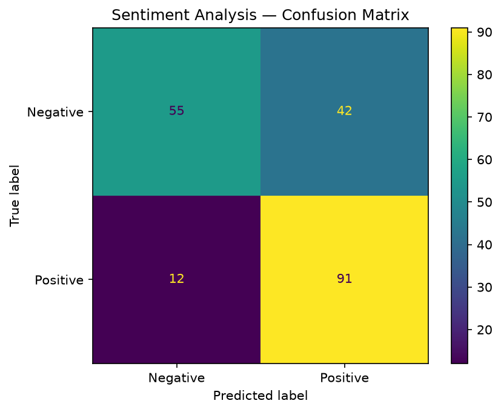

# Restaurant Review Sentiment Analysis — NLP

Classifies restaurant reviews as positive or negative using a bag-of-words model and Naive Bayes. The pipeline handles the full NLP chain: cleaning, stemming, stop word removal, vectorisation, and classification.

## The dataset

`Restaurant_Reviews.tsv` has 1,000 reviews from a restaurant, each labelled 0 (negative) or 1 (positive). It's tab-separated to avoid conflicts with commas in the review text. The data is roughly balanced.

## How it works

1. **Text cleaning** — strips everything that isn't a letter, lowercases
2. **Tokenisation + stemming** — splits into words, applies Porter stemmer (so "running", "ran", "runs" all become "run")
3. **Stop word removal** — removes common English words that carry no sentiment, but keeps "not" because it flips meaning
4. **Bag of Words** — `CountVectorizer` with 1,500 features turns the corpus into a sparse term-frequency matrix
5. **Naive Bayes classifier** — `GaussianNB` on the dense matrix

## Expected results

Accuracy on the test set is typically around **72–76%**. That's decent for such a simple pipeline — no TF-IDF, no word embeddings, just raw word counts. The confusion matrix usually shows the model is slightly better at identifying positives than negatives.

## How to run

```bash
python natural_language_processing.py
```

Downloads NLTK stopwords on first run (requires internet, ~few KB). Prints accuracy and confusion matrix. Saves `plots/confusion_matrix.png`.

## Code structure

```
SentimentAnalyzer
├── load_data()        → reads TSV with tab delimiter and no quoting
├── clean_corpus()     → text cleaning + stemming + stop word removal
├── vectorize()        → fits CountVectorizer, returns dense array
├── train()            → fits GaussianNB
├── evaluate()         → accuracy + confusion matrix
└── save_plots()       → confusion matrix with class labels
```

## Notes

The `nltk.download('stopwords', quiet=True)` call is inside `clean_corpus()` so it only runs when actually needed and doesn't pollute startup. The `"not"` exception in stop word removal is important — without it, "not good" and "good" would be treated the same way.

If you want to improve accuracy, the next step would be TF-IDF weighting instead of raw counts, or swapping GaussianNB for a logistic regression.

## Sample output


