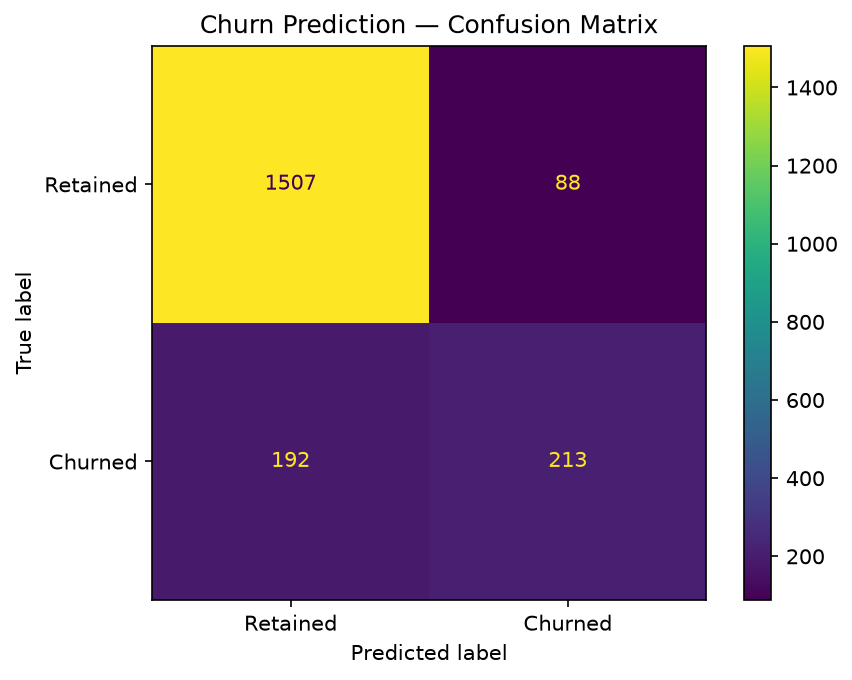

# Bank Customer Churn Prediction — Artificial Neural Network

Predicts whether a bank customer is going to leave (churn) based on their profile. The model is a small feedforward neural network built with PyTorch. With 10,000 rows and a mix of numeric and categorical features, it's a realistic classification problem.

## The dataset

`Churn_Modelling.csv` has 10,000 rows. The relevant features (columns 4–13) are:

- Credit Score, Geography, Gender, Age, Tenure
- Balance, Number of Products, Has Credit Card, Is Active Member, Estimated Salary

The target is `Exited` — 1 if the customer left, 0 if they stayed. About 20% of customers churned, so the dataset is moderately imbalanced.

## The model

Three dense layers: 6 → 6 → 1 (sigmoid output). Both hidden layers use ReLU. Trained with Adam optimizer and binary cross-entropy loss for 100 epochs, batch size 32. Nothing fancy — the point is to show the full pipeline, not push state-of-the-art numbers.

## Expected results

Test accuracy typically lands around **86%**. Given the 80/20 class split, a model that always predicts "stays" would get 80% — so we're meaningfully beating the naive baseline. The confusion matrix will show that the model misses a fair number of churners (false negatives), which is the harder class.

## How to run

```bash
python artificial_neural_network.py
```

Training takes 30–60 seconds depending on your machine and shows a tqdm progress bar per epoch. Prints accuracy and confusion matrix when done. Saves `plots/confusion_matrix.png` with "Retained" / "Churned" labels.

## Code structure

```
ChurnPredictor
├── load_data()        → reads CSV, extracts features (skip first 3 ID columns) and target
├── preprocess()       → label-encodes Gender, one-hot encodes Geography, splits 80/20, scales
├── train()            → PyTorch training loop, batch_size=32, epochs=100
├── evaluate()         → returns accuracy + confusion matrix as a dict
├── predict_single()   → takes a raw feature list, scales it, returns bool (churns or not)
├── save_model()       → saves model weights to a .pt file
├── load_model()       → restores a previously saved model
└── save_plots()       → confusion matrix PNG
```

## Notes

Geography gets one-hot encoded (France → [1,0,0], Spain → [0,1,0], Germany → [0,0,1]), Gender gets label encoded (Female → 0, Male → 1). The `predict_single()` method is handy for testing individual customers — pass a list of raw (unscaled) features and it handles the scaling internally.

Trained weights are saved automatically to `churn_model.pt`. You can reload them later with `predictor.load_model()` to run predictions without retraining. Use `--save-model path.pt` to change the output path.

## Sample output


