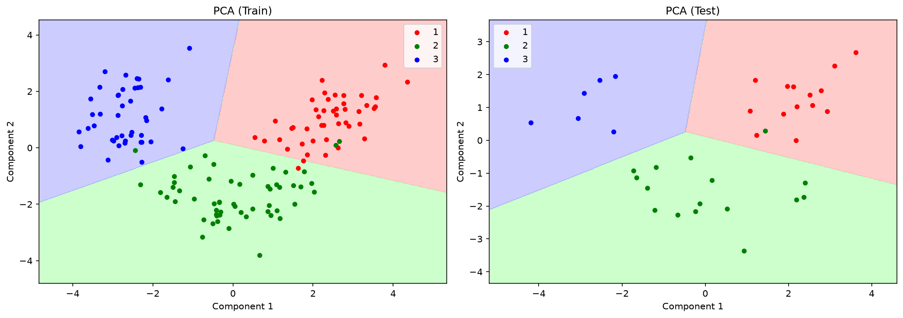
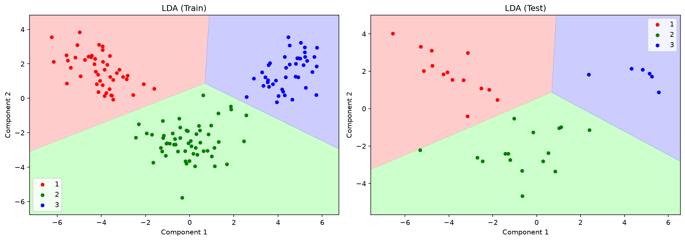
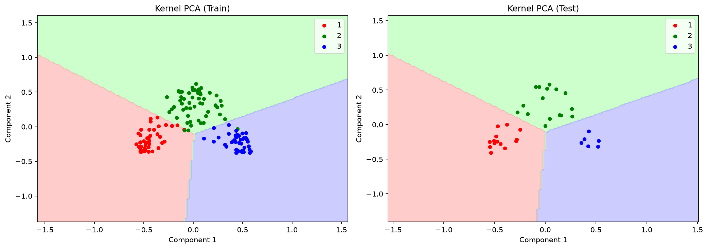

# Wine Quality Classification — Dimensionality Reduction Benchmark

Classifies wines by variety using a logistic regression model, but first reduces the 13-feature dataset down to 2 components using three different techniques: PCA, LDA, and Kernel PCA. The goal is to see how much information each method preserves, and to visualise how cleanly the three wine classes separate in 2D.

## The dataset

`Wine.csv` has 178 wine samples from three Italian wine varieties (classes 1, 2, 3) and 13 chemical measurements (alcohol, malic acid, ash, etc.). All 13 features are used as input; the class label is the target.

## Methods compared

| Reducer | Type | Key property |
|---|---|---|
| PCA | Unsupervised | Maximises variance in the projected space |
| LDA | Supervised | Maximises class separability — uses the labels during fit |
| Kernel PCA | Unsupervised | Non-linear projection using RBF kernel |

After reducing to 2 components, a logistic regression classifier is fitted on the projected training set and evaluated on the projected test set.

## Expected results

All three methods get high accuracy on this dataset because the wine classes are fairly well separated:

| Reducer | Accuracy |
|---|---|
| PCA | ~97% |
| LDA | ~100% |
| Kernel PCA | ~97% |

LDA tends to win because it's supervised — it's literally optimising for class separation. PCA and Kernel PCA aren't using the labels, so they occasionally put similar-looking samples from different classes in the same region.

## How to run

```bash
python main.py
```

Prints the accuracy table. Saves three plots to `plots/` — one per method — each showing the decision regions on the training and test sets side by side.

## Code structure

```
DimensionalityReductionBenchmark
├── load_data()          → reads Wine.csv, separates features and target
├── preprocess()         → 80/20 split, StandardScaler (required before PCA/LDA)
├── run_all()            → applies each reducer + fits logistic regression, returns accuracy table
├── _plot_decision_regions()  → helper for drawing 2D decision boundaries
└── save_plots()         → saves one side-by-side plot per reducer
```

The `REDUCERS` dict at class level makes it easy to add or swap methods.

## Notes

Scaling before PCA is mandatory — PCA is sensitive to feature variance, and unscaled features with large ranges (like Proline which goes 0–1500) would dominate the first component. LDA also benefits from scaling even though it's supervised. Kernel PCA with RBF is parameter-sensitive; `gamma` defaults to `1/n_features` in sklearn if not specified.

## Sample output




