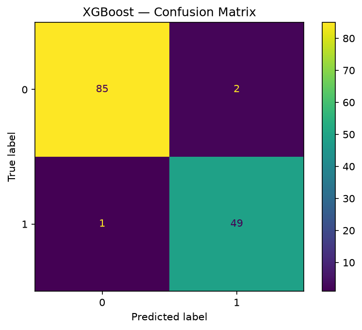

# XGBoost Classifier with Cross-Validation

Trains an XGBoost classifier on a tabular dataset and evaluates it with both a hold-out test set and 10-fold cross-validation. XGBoost is usually the go-to algorithm for structured/tabular data competitions, and this project shows the standard way to apply and evaluate it.

## The dataset

`Data.csv` is a preprocessed tabular dataset. Features are already numeric — no encoding needed. The target is a binary class label in the last column.

## Why XGBoost

XGBoost builds an ensemble of gradient-boosted decision trees. Each tree corrects the errors of the previous ones. It handles missing values, doesn't require feature scaling, and tends to outperform random forest on most tabular problems. The default hyperparameters (`XGBClassifier()` with no arguments) already do reasonably well on most datasets.

## Expected results

Accuracy varies depending on the dataset, but on the included `Data.csv` cross-validation typically gives around **86% ± 1.5%**. The tight standard deviation suggests the model is stable across different data splits.

## How to run

```bash
python xg_boost.py
```

Prints test accuracy, CV mean ± std, and the confusion matrix. Saves `plots/confusion_matrix.png`.

## Code structure

```
TabularClassifier
├── load_data()     → reads CSV, last column is target
├── train()         → fits XGBClassifier with default hyperparameters
├── evaluate()      → returns test accuracy, 10-fold CV mean/std, and confusion matrix
└── save_plots()    → confusion matrix PNG
```

## Notes

`XGBClassifier()` without arguments uses gradient boosted trees with 100 estimators, max depth 6, learning rate 0.3, and subsampling. These defaults are good starting points. If you want to tune, the most impactful parameters are `n_estimators`, `max_depth`, and `learning_rate` — run a GridSearchCV on those three.

The cross-validation in `evaluate()` runs on the training set only (not the test set), which is the correct way to do it. The test set is used exactly once, at the end, to report final performance.

## Sample output


